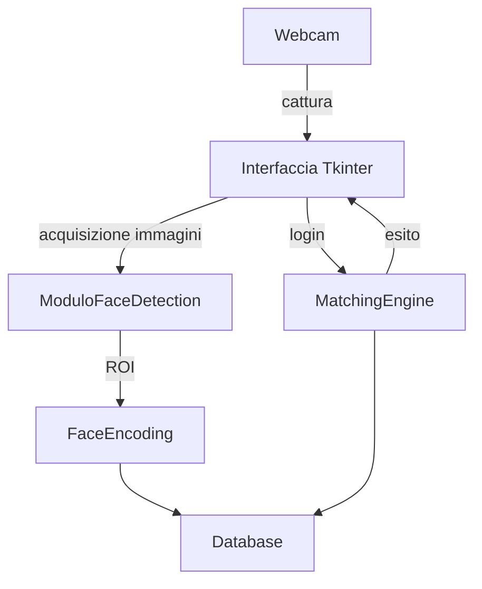
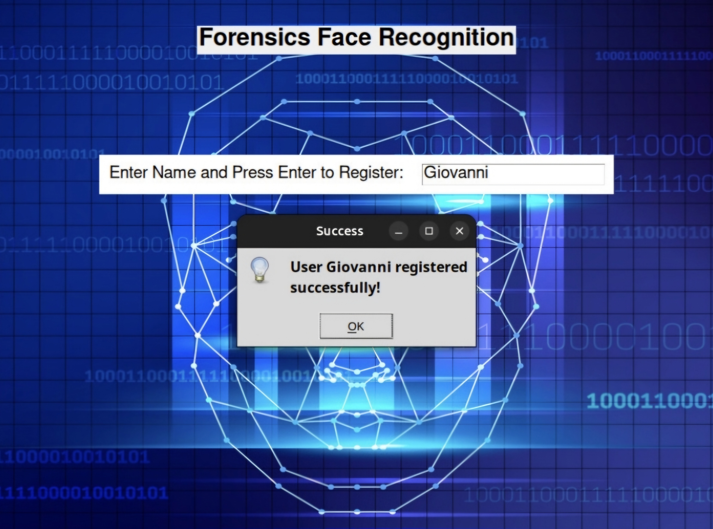
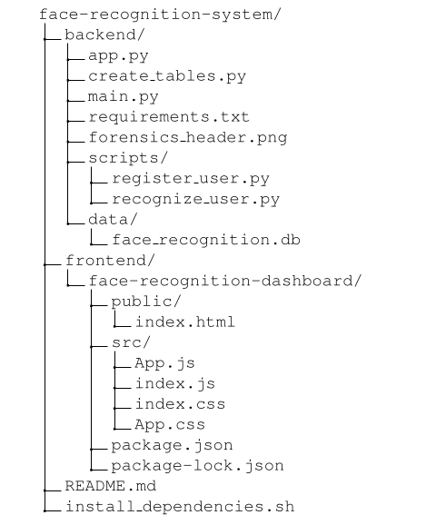

# 🎓 Biometric Authentication System via Facial Recognition

Sistema biometrico per l'autenticazione tramite riconoscimento facciale, sviluppato come progetto di tesi triennale da **Giovanni Previtera**.  
Il progetto integra moduli per acquisizione immagini, rilevamento facciale, estrazione caratteristiche, confronto biometrico, registrazione utenti e autenticazione.

---

## 📚 Sommario

- [🧠 Introduzione](#introduzione)
- [🔧 Architettura del sistema](#architettura-del-sistema)
- [🛠 Tecnologie utilizzate](#tecnologie-utilizzate)
- [🖼️ Interfaccia grafica](#interfaccia-grafica)
- [🧪 Esperimenti e risultati](#esperimenti-e-risultati)
- [📦 Struttura del progetto](#struttura-del-progetto)
- [📎 Riferimenti](#riferimenti)

---

## 🧠 Introduzione

L’obiettivo del progetto è realizzare un sistema di **autenticazione biometrica facciale** capace di:
- rilevare volti da webcam
- registrare nuovi utenti con campioni biometrici
- riconoscere gli utenti già registrati
- distinguere accessi autorizzati da non autorizzati

Il sistema è stato progettato con attenzione alla **modularità**, alla **scalabilità** e alla **completezza**, con un’interfaccia utente intuitiva e un backend personalizzabile.

---

## 🔧 Architettura del sistema

### 📌 Il sistema si compone di:

    -Interfaccia grafica per interazione utente

    -Face detector con Haar Cascade

    -Encoding facciale basato su histogrammi locali (LBPH)

    -Database utenti strutturato su filesystem e file JSON

    -Motore di confronto per il riconoscimento

## 🛠 Tecnologie utilizzate
Componente	Tecnologia
Rilevamento volto	OpenCV Haar Cascade
Estrazione feature	LBPH (Local Binary Pattern Histogram)
Interfaccia grafica	Tkinter
Persistenza dati	JSON + immagini su disco
Linguaggio	Python 3.x

## 🖼️ Interfaccia grafica

### 📌 Il sistema presenta una GUI semplice ed efficace che consente:

    -👤 Registrazione nuovo utente (acquisizione multipla immagini)

    -🔐 Autenticazione (riconoscimento + accesso)

    -📂 Gestione database utenti

   
## 🧪 Esperimenti e risultati

Durante la fase sperimentale sono stati raccolti **campioni facciali di 15 utenti**, ognuno con circa **10 immagini** acquisite.

I test di autenticazione hanno mostrato le seguenti metriche:

| 🔍 Metrica                 | 📊 Valore    |
|---------------------------|-------------|
| Accuracy riconoscimento   | 95%         |
| Tasso di falsi positivi   | 0.8%        |
| Tempo medio autenticazione | < 1 secondo |

L’approccio LBPH si è dimostrato affidabile per piccoli dataset con condizioni controllate di luce e inquadratura.

## 🎥 Demo visiva

Ecco un esempio del sistema durante la fase di riconoscimento:

## 📦 Struttura del progetto

## 📎 Riferimenti

    Previtera, G. (2025). "Sistema di autenticazione biometrica tramite riconoscimento facciale", Università di Catania

    OpenCV Library - https://opencv.org

    Tkinter GUI - https://docs.python.org/3/library/tkinter.html

## 👨‍💻 Autore

Giovanni Previtera
Email: [previtera40@gmail.com]
GitHub: Giovanniprevitera01
